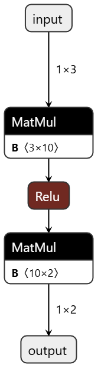

# TensorRT for RTX Hello World Sample

This sample demonstrates how to use TensorRT for RTX to create, compile, and
run a simple neural network. The sample shows basic concepts such as:

- Creating a TensorRT-RTX builder and network definition.
- Building a simple fully connected neural network.
- Parsing a provided ONNX model.
- Performing ahead-of-time (AOT) compilation.
- Running inference with the compiled engine.

## Building the Sample

### Prerequisites

- CMake 3.10 or later
- Python 3.9 or later
- CUDA Toolkit
- An installation of TensorRT for RTX

### Build Instructions

On Windows, add the TensorRT for RTX `lib` directory to your `PATH` environment variable:

```powershell
$Env:PATH += ";$Env:PATH_TO_TRT_RTX\lib"
```

On Linux, add the TensorRT for RTX `lib` directory to your `LD_LIBRARY_PATH` environment variable:

```bash
export LD_LIBRARY_PATH=$LD_LIBRARY_PATH:${PATH_TO_TRT_RTX}/lib
```

#### Build for C++

1. Run CMake from the current or the `cpp` directory, pointing it to your TensorRT for RTX installation, to create artifacts in the `build` directory

   ```bash
   cmake -B build -S . -DTRTRTX_INSTALL_DIR=/path/to/tensorrt-rtx
   ```

2. Build the sample:

   ```bash
   cmake --build build
   ```

#### Build for Python

1. Install the `tensorrt_rtx` wheel from your TensorRT for RTX directory:

   ```bash
   python -m pip install /path/to/tensorrt-rtx/python/tensorrt_rtx-${version}-cp${py3-ver}-none-${os-ver}_x86_64.whl
   ```

2. Install `numpy` and `cuda-python` from the `python/requirements.txt` file:

   ```bash
   python -m pip install -r python/requirements.txt
   ```

## Running the Sample

After building, you can run the sample with:

```bash
./helloWorld
```

from the build directory.

To build the network by parsing the provided ONNX model, run:

```bash
./helloWorld --onnx=/path/to/helloWorld.onnx
```

For the Python sample, run:

```bash
python hello_world.py
python hello_world.py --onnx=/path/to/helloWorld.onnx
```



The sample will:

1. Create and compile a simple neural network.
2. Run inference with different input values.
3. Display the results.

## Code Overview

The sample demonstrates several key concepts:

- Network creation and configuration.
- Network creation by parsing an ONNX model.
- Engine serialization and deserialization.
- Inference execution.

For detailed comments explaining each step, please refer to the [helloWorld.cpp](cpp/helloWorld.cpp) and [hello_world.py](python/hello_world.py) source files.
